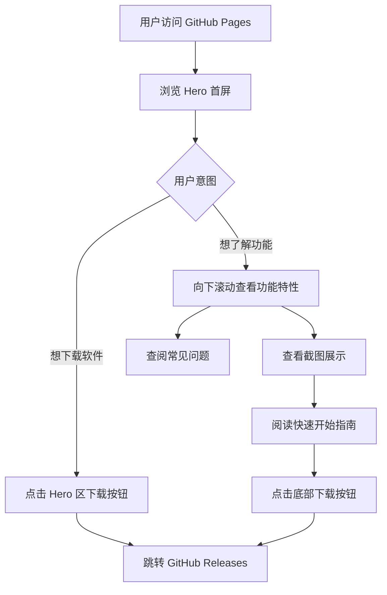

## 1. 产品概述

SSH Client Plus 是一款面向个人用户的 Windows 平台 SSH/SFTP 桌面客户端。本产品旨在为普通用户提供一个安全、美观、易用的远程服务器管理工具，解决传统终端工具配置复杂、界面简陋的问题。

目标用户：需要管理远程服务器但非深度技术背景的普通用户，以及追求高效和美观体验的开发者。

## 2. 核心功能

### 2.1 功能模块

1. **首页 (Landing Page)**：展示软件核心价值、功能特性、界面截图、快速开始指南和下载入口。

### 2.2 页面详情

| 页面名称 | 模块名称  | 功能描述                                                                                                                                |
| -------- | --------- | --------------------------------------------------------------------------------------------------------------------------------------- |
| 首页     | Hero 首屏 | 展示软件大标题、核心价值主张（一句话描述）、主下载按钮（链接到 GitHub Releases）、软件预览大图。使用粒子或光效背景增强科技感。          |
| 首页     | 功能特性  | 使用图标卡片网格展示 6-8 个核心功能（如：加密主机库、多标签、终端/SFTP/监控三合一、命令片段、拖拽上传、跳板机支持等）。悬浮时有微动效。 |
| 首页     | 截图展示  | 展示软件界面截图的画廊区域，支持点击放大查看。使用带边框和阴影的玻璃拟态相框。                                                          |
| 首页     | 快速开始  | 分步骤展示安装和首次使用流程（下载安装 → 设置主密码 → 添加主机 → 开始连接），使用带编号的步骤卡片。                                     |
| 首页     | 常见问题  | FAQ 折叠面板，包含 5-6 个常见问题。点击展开/收起答案，带平滑过渡动画。                                                                  |
| 首页     | 页脚      | 包含 GitHub 仓库链接、版权信息、简洁的底部导航。                                                                                        |

## 3. 核心流程

用户访问页面的主要流程如下：

## 4. 用户界面设计

### 4.1 设计风格

- **主色调**：深空蓝黑背景 (`#0a0e1a`)，搭配霓虹蓝 (`#4facfe`) 和电光紫 (`#7c3aed`) 作为强调色。
- **玻璃拟态**：半透明卡片背景，带微妙的边框和背景模糊效果，与软件本身的设计风格一致。
- **按钮样式**：主按钮使用渐变背景 + 发光效果，次按钮使用玻璃边框。圆角 12px。
- **字体**：标题使用 `Outfit` 或 `Cabinet Grotesk` 等现代无衬线字体，正文使用系统默认无衬线字体。代码片段使用 `JetBrains Mono`。
- **图标风格**：线性 SVG 图标，与强调色一致。
- **动效**：滚动触发的淡入上浮动画，悬浮时的发光和位移动效。

### 4.2 页面设计概述

| 页面名称 | 模块名称  | UI 元素                                                                                                       |
| -------- | --------- | ------------------------------------------------------------------------------------------------------------- |
| 首页     | Hero 首屏 | 深色渐变背景 + 网格线纹理。居中大标题（渐变文字），副标题，发光下载按钮。底部展示一张带透视效果的软件预览图。 |
| 首页     | 功能特性  | 深色背景。3-4 列网格卡片，每个卡片包含图标、标题、简短描述。卡片有玻璃边框，悬浮时边框发光并轻微上浮。        |
| 首页     | 截图展示  | 横向滚动画廊或瀑布流布局。截图放在带圆角和阴影的玻璃相框中。背景有柔和的渐变光晕。                            |
| 首页     | 快速开始  | 时间线或步骤卡片布局。每步包含编号（渐变圆圈）、标题、描述和可选的代码片段（带复制按钮）。                    |
| 首页     | 常见问题  | 手风琴折叠面板。问题标题带箭头指示器，展开时箭头旋转。面板有玻璃背景。                                        |
| 首页     | 页脚      | 深色背景，居中显示版权信息和 GitHub 链接。                                                                    |

### 4.3 响应式设计

- **桌面优先**：针对 1200px+ 宽度优化布局。
- **平板适配**：768px-1199px，网格列数减少，间距调整。
- **移动适配**：<768px，单列布局，汉堡菜单（如需要），字体缩小，间距紧凑化。
- **触摸优化**：按钮最小点击区域 44px，折叠面板支持触摸操作。
