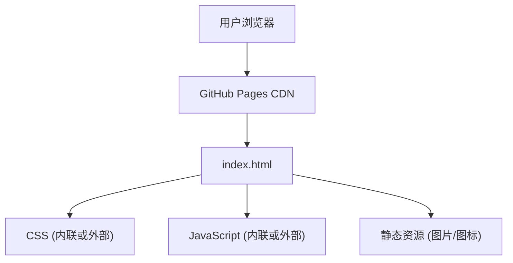

## 1. 架构设计

GitHub Pages 为纯静态单页应用，无后端服务。

## 2. 技术描述

- **前端**：纯 HTML5 + CSS3 + Vanilla JavaScript（无框架依赖，确保 GitHub Pages 直接托管，加载性能最优）。
- **样式**：CSS 自定义属性实现主题变量，CSS Grid 和 Flexbox 实现布局。
- **动画**：CSS `@keyframes` + `IntersectionObserver` 实现滚动触发动画。
- **图标**：内联 SVG。
- **字体**：Google Fonts CDN 加载。

## 3. 文件结构

| 文件/目录 | 用途 |
|-----------|------|
| `docs/index.html` | 主页面文件 |
| `docs/assets/style.css` | 样式表 |
| `docs/assets/script.js` | 交互逻辑 |
| `docs/assets/images/` | 截图和图片资源 |

## 4. 部署方式

- 使用 GitHub Pages 的 `/docs` 目录作为发布源。
- 在仓库 Settings → Pages 中选择 `Deploy from a branch`，分支选 `main`，目录选 `/docs`。
