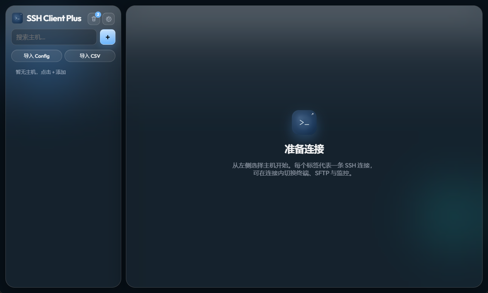

# SSH Client Plus

个人自用的 Electron SSH / SFTP 客户端（Windows）。



## 功能

- 主密码保护的本地加密主机库
- 密码 / 私钥登录，连接前预检（可达性、私钥、跳板）
- ProxyJump 跳板机
- 可配置 Keepalive + 断线自动重连
- 多连接标签、每连接内切换终端 / SFTP / 监控
- 按主机记录的命令历史（终端 / SFTP 自动收集）
- 主机导入（`~/.ssh/config`，支持 Include / ProxyJump）
- 手动检查更新（对照 GitHub Releases）
- 数据备份 / 从备份恢复
- 主机密钥校验（known_hosts）
- 标签颜色与备注
- SFTP：浏览 / 上传下载（含目录）/ 拖拽上传 / 路径书签
- 字体与深 / 浅玻璃主题

---

## 安装与运行

### 方式一：安装包（推荐）

1. 运行 `dist/ssh-client-plus-x.x.x-setup.exe` 完成安装。
2. 从开始菜单或桌面快捷方式打开 **SSH Client Plus**。

### 方式二：免安装

解压 `dist/SSH Client Plus-x.x.x-win.zip`，或打包后直接使用：

```text
dist/win-unpacked/SSHClientPlus.exe
```

### 首次使用

1. 启动后会进入解锁页。
2. **首次使用**可选择：
   - 设置**主密码**（至少 6 位），以后每次打开需输入；
   - 或开启**本机自动解锁**（Windows 凭据保护，本机免密进入）。
3. 进入主界面后，左侧主机列表为空，需自行添加或导入主机。

> 每台电脑的数据相互独立。安装包**不包含**任何账号信息；主机、密码等仅保存在本机用户目录（见下文「数据存储」）。

---

## 使用说明

### 界面概览

```text
┌─────────────┬──────────────────────────────────────────┐
│  主机侧栏    │  [连接标签 …]              [+ 新连接]     │
│  搜索/添加   ├──────────────────────────────────────────┤
│  主机列表    │  连接名 · 终端 | SFTP | 监控      [历史]  │
│  设置/回收站 │  ─────────────────────────────────────── │
│             │  终端 / 文件 / 监控内容区                 │
└─────────────┴──────────────────────────────────────────┘
```

- **顶栏标签**：每条标签 = 一条独立的 SSH 连接。
- **终端 | SFTP | 监控**：属于当前选中连接，切换视图不会断开连接。
- **+ 新连接**：为当前主机再建一条 SSH 连接（新标签）。
- **历史**：查看当前主机自动记录的命令，点击复制。

### 主机管理

| 操作            | 说明                                  |
| --------------- | ------------------------------------- |
| 点击主机卡片    | 建立 SSH 连接并打开新标签             |
| 悬浮卡片        | 显示编辑 / 删除按钮                   |
| 搜索框          | 按名称、地址、分组过滤                |
| **+**           | 添加新主机                            |
| **导入 Config** | 从 `~/.ssh/config` 导入               |
| **设置**        | 终端字体、主题、Keepalive、自动重连等 |
| **回收站**      | 误删主机可还原                        |
| 侧栏底部版本号  | 点击检查 GitHub Releases 是否有新版本 |

添加主机时可配置：地址、端口、用户名、密码或私钥路径、跳板机、标签颜色、备注等。

### 终端

- 输入命令与常见 SSH 终端一致。
- **Ctrl + F**：搜索终端输出。
- **Ctrl + C**：有选区时复制；无选区时发送 SIGINT 到远端。
- **Ctrl + V**：粘贴剪贴板内容。
- **Ctrl + 滚轮**：放大 / 缩小字体（10～28，会写入设置）。
- **右键**：有选区则复制，否则粘贴。
- 连接断开时支持自动重连（可在设置中开关）。

### SFTP

- 在连接内切换到 **SFTP** 标签即可浏览远端文件。
- 点击路径栏可输入 `cd` 或绝对路径后回车跳转。
- 支持：上传、下载、新建文件夹、重命名、删除、拖拽上传到当前目录。
- 文本文件可预览 / 编辑（需读写权限）。
- 星标可收藏当前路径；常用目录下拉含 `/`、`~`、`/home` 等。
- 无读权限的文件 / 目录整行置灰且不可点击。

### 监控

- 在连接内切换到 **监控** 标签，查看 CPU、内存、磁盘、网络、进程、端口、服务等（需 SSH 会话可用）。

### 命令历史

- 终端回车发送的命令、SFTP 路径栏中的 `cd` 命令会自动记入**当前主机**历史（纯路径跳转不记）。
- 点 **历史** 打开下拉列表；点击一项即复制，提示「指令已复制」。
- 每主机最多保留最近 50 条，相同命令会提到最前；删除主机时一并清除。

### 连接标签

- 顶栏每个标签对应一条 SSH 连接，可关闭（×，悬浮显示）。
- 同一主机可开多条连接（标签会显示 `主机名 #2`、`#3` …）。

---

## 快捷键

| 快捷键      | 作用                |
| ----------- | ------------------- |
| Ctrl + F    | 终端内搜索输出      |
| Ctrl + C    | 复制选区 / 发送中断 |
| Ctrl + V    | 粘贴                |
| Ctrl + 滚轮 | 调节终端字号        |

---

## 数据存储

主机、命令历史、书签、设置等保存在本机加密数据文件中，**不会**打入安装包。

| 项目         | 位置                                   |
| ------------ | -------------------------------------- |
| 用户数据目录 | `%APPDATA%\ssh-client\`                |
| 保险库文件   | `%APPDATA%\ssh-client\vault\vault.dat` |

- **开发版**（`pnpm dev` / `pnpm preview`）与**安装版**在本机会共用同一目录，因此本机测试数据会出现在打包 app 中。
- **其他电脑**首次安装为空库，走全新设置流程。
- 主密码无法找回；可在解锁页「重置保险库」清空全部本地数据（不可恢复）。
- 私钥仅保存**文件路径**，私钥内容不会写入保险库。

资源管理器中可输入 `%APPDATA%\ssh-client` 直接打开数据目录。

---

## 升级

1. 侧栏底部点击版本号可**检查更新**；若有新版本会显示轻量提示，可前往 GitHub Releases 下载。
2. 也可直接打开 [Releases](https://github.com/ajaxsync/ssh-client/releases) 下载安装包。
3. 安装覆盖即可；本机账号与主机数据在 `%APPDATA%\ssh-client`，一般不会被安装程序清除。

应用内检查更新仅对照 GitHub Releases 最新版本并跳转下载页，**不会自动下载或安装**。

---

## 开发

```bash
pnpm install
pnpm dev
```

类型检查与构建：

```bash
pnpm typecheck
pnpm build
pnpm preview      # 以生产构建启动 Electron，用于打包前验证
```

打包（Windows）：

```bash
pnpm dist         # 安装包 + zip
pnpm dist:dir     # 仅解包目录，可直接运行 dist/win-unpacked/SSHClientPlus.exe
```

打包前建议：

1. 关闭正在运行的 Electron / SSH Client Plus 窗口。
2. 若遇 `EPERM` 重命名错误，删除 `dist\win-unpacked` 与 `dist\win-unpacked.tmp` 后重试。

其他说明：

- Windows 若未安装 Visual Studio C++ 工具，会跳过 `ssh2` 原生加速（功能正常，纯 JS 实现）。
- 浏览器访问 dev server 的 IP 地址**无法**正常使用（缺少 Electron 环境），请始终通过 `pnpm dev` 弹出的窗口或安装后的 exe 使用。

---

## 常见问题

**Q：打包后的 app 里为什么有我的测试账号？**  
A：本机开发版与安装版共用 `%APPDATA%\ssh-client`。换一台干净电脑安装即为空库。

**Q：如何彻底清空本地数据？**  
A：关闭应用后删除 `%APPDATA%\ssh-client`，或在解锁页重置保险库。

**Q：忘记主密码怎么办？**  
A：无法恢复，只能重置保险库（会删除全部主机与设置）。
